# Red-Black Maze

**Red-Black Maze** es un shooter en primera persona con motor de *raycasting*, escrito en **Rust** sobre **Raylib**. Es un laberinto-shooter de estética retro (pixel-art, resolución baja, sensación de PC antiguo) ambientado en un casino oscuro y corrompido: paredes con palos de la baraja, crupieres que te persiguen por los pasillos y un jefe final coronado, **The King**.

El juego incluye cuatro niveles (tres diseñados a mano y uno generado proceduralmente), dos modos de juego completamente distintos —**Portal Mode** y **Horde Mode**—, combate *hitscan* con gestión de cargador y reserva, una mejora de arma (**Royal Flush**), sistema de audio con música y efectos propios, minimapa, y un ciclo completo de pantallas: bienvenida → selección de nivel y modo → partida → victoria / derrota, con pausa en cualquier momento.

<p align="center">
  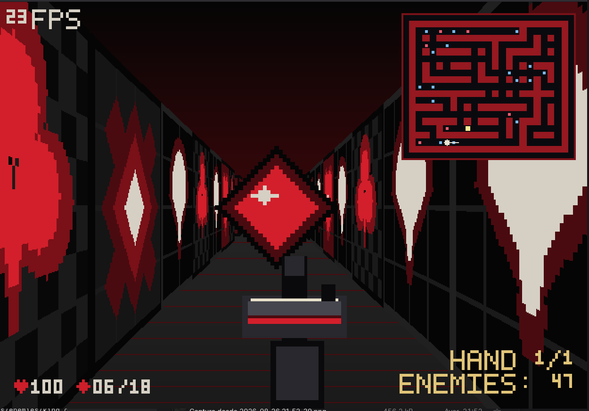
</p>

---

## 🎬 Video de demostración

**[▶ Ver la demostración completa de Red-Black Maze](https://canva.link/ctxjdfvs4l9oygs)**

Grabaciones de juego incluidas en el repositorio:

| Video | Contenido |
|---|---|
| [▶ `docs/videos/mod_portal.mp4`](docs/videos/mod_portal.mp4) | Partida de **Portal Mode** (recorrer el laberinto hasta el portal). |
| [▶ `docs/videos/mod_horde.mp4`](docs/videos/mod_horde.mp4) | Partida de **Horde Mode** (Dealer Hands, Royal Flush y combate contra The King). |
| [▶ `docs/videos/welcome.mp4`](docs/videos/welcome.mp4) | Pantalla de bienvenida y selección de nivel / modo. |

> GitHub no reproduce archivos `.mp4` incrustados de forma fiable; los enlaces de arriba descargan o abren cada grabación directamente.

---

## Características principales

- **Motor de raycasting propio** en primera persona, con vista alternativa de mapa 2D (cenital) para depuración.
- **Cuatro niveles**: Crimson Entrance, Black Club, House of Cards y **The Dealer's True Maze** (procedural, distinto en cada partida).
- **Dos modos de juego**: Portal Mode (llegar a la salida) y Horde Mode (oleadas + jefe final).
- **Combate hitscan** con cargador de 6, reserva de hasta 30 y animación de recarga.
- **The Dealer**: enemigo que persigue con pathfinding BFS y ataca cuerpo a cuerpo.
- **The King**: jefe final de Horde Mode con 1000 de vida, fases de invocación, invulnerabilidad señalizada, huida y oleada de castigo.
- **Royal Flush**: mejora de la misma arma que duplica el daño, clave para vencer a The King.
- **Pickups** de munición y de vida, reabastecimiento entre oleadas y munición de emergencia.
- **Identidad visual de casino**: corazones, diamantes, tréboles y picas; cada nivel adapta su paleta de color.
- **Minimapa** en la esquina, con marcadores de jugador, The King (durante la huida) y objetos (en el nivel procedural).
- **Audio propio**: 8 pistas de música y 21 efectos de sonido, con transición musical especial durante la batalla final.
- **Pantallas completas**: bienvenida, selección de nivel/modo, pausa, victoria y derrota, todas con navegación real por teclado y ratón.
- **Contador de FPS** en pantalla en todo momento durante el juego.

---

# Manual del jugador

## Objetivo

Depende del modo elegido en la pantalla de selección:

- **Portal Mode** — Atraviesa el laberinto y alcanza el **portal** (un emblema rojo brillante). Al pisarlo, ganas el nivel. Los Dealers repartidos por el mapa te persiguen; puedes esquivarlos o eliminarlos, pero no reaparecen.
- **Horde Mode** — No hay portal. Sobrevives a oleadas sucesivas de Dealers (**Dealer Hands**) hasta la **Final Hand**, que es el combate contra **The King**. Ganas cuando The King cae.

En ambos modos, si tu vida llega a **0**, pierdes.

## Controles

| Acción | Control |
|---|---|
| Avanzar / retroceder | `W` / `S` |
| Desplazamiento lateral (*strafe*) | `A` / `D` |
| Girar la cámara | Mover el ratón (horizontal) |
| Disparar | Clic izquierdo del ratón |
| Recargar | `R` |
| Pausar / reanudar | `Esc` |
| Alternar vista 3D ↔ mapa 2D | `M` |
| Navegar menús | `↑` `↓` (o `W` `S`) y `←` `→` (o `A` `D`) |
| Confirmar en menús | `Enter` (o clic sobre la opción) |
| Volver / salir de un menú | `Esc` |
| Empezar desde la bienvenida | `Enter`, `Espacio` o clic en `PLAY` |

El movimiento con teclado y el giro con ratón son canales independientes: puedes moverte y girar en el mismo instante. El movimiento diagonal está normalizado, así que no es más rápido que el movimiento recto. El jugador se desliza a lo largo de las paredes en vez de quedarse clavado contra ellas.

## Cámara y movimiento

- Vista en primera persona con campo de visión de **60°**.
- La cámara nunca rota sola: solo el ratón la gira.
- Velocidad del jugador: 150 px/s. Los Dealers persiguen a 75 px/s (la mitad), así que siempre puedes ganarles distancia maniobrando.
- Con la tecla `M` puedes cambiar a una **vista de mapa 2D** cenital (útil para orientarte o depurar); el juego sigue corriendo igual.

## Disparo y recarga

- El arma es **hitscan**: el disparo impacta al instante en la línea de la mira. Alcanza al enemigo más cercano que esté delante de la primera pared.
- **Cargador**: 6 balas. **Reserva inicial**: 18. **Reserva máxima**: 30.
- Cadencia: un disparo cada 0.25 s. Recarga: 0.8 s (con animación del arma).
- Si el cargador está vacío y no queda reserva, no puedes disparar hasta recoger munición.

## HUD

Durante la partida (vistas 3D y 2D):

| Elemento | Posición | Significado |
|---|---|---|
| `N FPS` | Arriba a la izquierda | Fotogramas por segundo (media móvil de Raylib). |
| Corazón + número | Abajo a la izquierda | Vida actual (máx. 100). |
| Diamante + `M / R` | Abajo a la izquierda | Balas en el cargador `/` balas en reserva. |
| `HAND N/M` · `ENEMIES: K` | Abajo a la derecha | *(Solo Horde)* Oleada actual / última oleada normal, y Dealers vivos. |
| Minimapa | Arriba a la derecha | Mapa del nivel, posición y orientación del jugador. |
| `THE KING` + barra roja | Arriba al centro | *(Solo Horde, Final Hand)* Vida de The King. Sustituye al contador de oleadas. |
| `DEALERS: n` · `KILLED: k/t` | Abajo a la derecha | *(Durante el combate del jefe)* Dealers invocados vivos, y matados / invocados en total. |
| Mensajes centrales | Centro / franja superior | `THE HOUSE IS RELOADING...`, `NEXT HAND IN 3...`, `HAND II`, avisos de The King, etc. |

Los colores del corazón y del icono de munición se adaptan a la paleta del nivel (rojo en Crimson Entrance, naranja en Black Club, violeta en House of Cards).

---

## Portal Mode 🃏

Portal Mode es el modo clásico de laberinto-shooter.

- El nivel tiene un **portal** (renderizado como un emblema rojo) situado lejos del punto de partida. Alcanzarlo termina el nivel con **victoria**.
- Los Dealers están colocados en posiciones fijas del mapa (marcadores `e`). Te persiguen si te acercas lo suficiente, atacan cuerpo a cuerpo, y **al morir no reaparecen**.
- **No** hay Dealer Hands, **no** aparece Royal Flush y **no** aparece The King. La munición y la vida son las que trae el nivel de fábrica más lo que recojas.
- El objetivo es puramente de exploración y supervivencia: llega a la salida con vida.

Al completar un nivel, la pantalla de victoria ofrece `NEXT LEVEL` para avanzar al siguiente del catálogo.

[▶ Ver gameplay de Portal Mode](docs/videos/mod_portal.mp4)

---

## Horde Mode 👑

Horde Mode cambia la lógica del nivel: el portal deja de renderizarse y pisarlo no hace nada. En su lugar entra en juego la progresión de **Dealer Hands**.

Flujo de una partida de Horde:

1. **HAND I** — El nivel arranca con una primera oleada de Dealers (cantidad según el nivel).
2. Cuando **todos** los Dealers vivos de la oleada caen, empieza una intermisión: **"THE HOUSE IS RELOADING..."** seguida de la cuenta atrás **"NEXT HAND IN 3... 2... 1..."**.
3. Aparece la siguiente oleada, con el doble de Dealers que la anterior (hasta el tope del nivel), y un breve cartel **"HAND II"**, **"HAND III"**, etc.
4. Entre oleadas, el juego reparte **munición y vida de recuperación** por el mapa.
5. En la penúltima oleada aparece **The Royal Flush** en algún lugar del nivel.
6. Al terminar la última oleada numerada llega la **Final Hand**: no son Dealers, es **The King**.
7. Derrotar a The King es la **victoria** de Horde Mode.

### Progresión por nivel

| Nivel | Oleadas de Dealers | Tope simultáneo | Royal Flush aparece en |
|---|---|---|---|
| Crimson Entrance | 4 → 8 → 16 → **The King** | 16 | HAND III |
| Black Club | 4 → 8 → 16 → **The King** | 16 | HAND III |
| House of Cards | 4 → 8 → 16 → 32 → **The King** | 32 | HAND IV |
| The Dealer's True Maze | 40–50 (según semilla) → **The King** | 50 | desde el inicio de la partida |

El tope global absoluto de Dealers vivos a la vez es 52, se aplique el nivel que se aplique.

[▶ Ver gameplay de Horde Mode](docs/videos/mod_horde.mp4)

---

## Dealer Hands

Cada "Hand" (mano de cartas) es una oleada de Dealers. La transición entre oleadas es una sub-fase dentro de la partida —el jugador se sigue moviendo con normalidad—, no una pantalla aparte.

**Secuencia de una intermisión** (dura ~4 s de tiempo de juego):

| Tiempo | Mensaje |
|---|---|
| 0 – 1 s | `THE HOUSE IS RELOADING...` |
| 1 – 2 s | `NEXT HAND IN 3...` |
| 2 – 3 s | `NEXT HAND IN 2...` |
| 3 – 4 s | `NEXT HAND IN 1...` |
| Al aparecer la oleada | Cartel breve `HAND <número romano>` (~1 s) |

**Reglas:**

- El fin de una oleada se decide por **Dealers vivos == 0**, nunca por el número de entidades: un cadáver sigue siendo visible unos 15 s antes de desaparecer, pero ya no cuenta.
- El escalado es **×2** sobre la oleada anterior, recortado al tope del nivel.
- Los Dealers nuevos aparecen a distancia navegable segura del jugador (nunca encima ni ya alertados), fuera de su cono de visión cuando es posible.
- La **Final Hand** no muestra cartel `HAND N` para no pisar la barra de vida de The King: en su lugar aparece la etiqueta `THE KING`.
- Cuando The King entra en el mapa, el contador de oleadas se congela.

---

## Recursos y economía

En Horde Mode el juego reabastece al jugador de forma dinámica; en Portal Mode solo cuentan los recursos del nivel más lo que recojas.

### Pickups

| Pickup | Efecto | Notas |
|---|---|---|
| **Ammo Pickup** (diamante rojo) | +6 balas a la reserva | Si la reserva ya está al máximo (30), el pickup permanece en el suelo para no desperdiciarlo. |
| **Health Pickup** (corazón) | +20 de vida | Si la vida ya está al máximo (100), el pickup permanece en el suelo. |

### Reabastecimiento entre oleadas (Horde)

Al empezar cada oleada nueva, el juego coloca munición y vida en el mapa. La cantidad de munición se ajusta al estado real del jugador, en tres tramos:

- **Tramo escaso** — Si al jugador le quedan ≤ 20 balas (cargador + reserva) y ya no hay recargas de munición por recoger: lote completo de **4 pickups** (2 de fácil acceso + 2 en sitios más apartados).
- **Tramo medio** — Si le quedan ≤ 30 balas y todavía hay pickups en el mapa: **3 pickups** (1 de fácil acceso + 2 apartados).
- **Tramo normal** — El resto de casos: la fórmula base, dimensionada según cuántos Dealers trae la oleada.

Los pickups "de fácil acceso" se colocan cerca del jugador pero fuera de su vista directa (un rodeo corto y sin peligro); el resto se reparte por el mapa. También se hace un *top-up* de vida.

### Munición de emergencia

Si el jugador se queda **sin balas** a mitad de una oleada (no al empezarla), el juego coloca un lote de emergencia de **4 pickups** de munición muy cerca, para que nunca quede atrapado sin forma de disparar. Este sistema es independiente del reabastecimiento entre oleadas.

### Reabastecimiento durante el combate del jefe

Cada vez que The King invoca una cohorte de Dealers, se aplica la misma regla de reabastecimiento por tramos (munición y vida), de modo que el combate final no se convierte en una carrera de recursos.

---

## Royal Flush

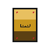

**The Royal Flush** es una mejora de tu **única arma**, no un arma nueva ni un segundo *slot*. Sigue habiendo un solo cargador y una sola reserva; lo que cambia es el daño y el aspecto.

| | Standard | Royal Flush |
|---|---|---|
| Daño por disparo | 50 | 100 |
| Disparos para matar a un Dealer (100 de vida) | 2 | 1 |
| Disparos para matar a The King (1000 de vida) | 20 | 10 |

- **Solo aparece en Horde Mode.**
- En Crimson Entrance, Black Club y House of Cards aparece al comenzar la **penúltima oleada**, repartida en algún punto del mapa.
- En **The Dealer's True Maze** aparece **desde el inicio de la partida**, porque ese nivel llega a The King ya en la primera oleada y hace falta tiempo real para encontrarla en un mapa enorme (además se marca en el minimapa).
- Una vez recogida, el cambio de tier es permanente durante esa partida. Retry y cambio de nivel reconstruyen la sesión desde cero, así que siempre se empieza con el arma Standard.
- Enfrentarse a The King con el arma Standard es posible pero muy largo (20 impactos limpios); con Royal Flush la batalla es la mitad de exigente.

---

## The King

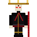

**The King** es el jefe final de Horde Mode: el crupier coronado que dirige la casa. Aparece como **Final Hand** de cualquier nivel en Horde Mode, una sola vez por partida.

| Atributo | Valor |
|---|---|
| Vida | 1000 |
| Daño de ataque cuerpo a cuerpo | 20 (el doble que un Dealer) |
| Cadencia de ataque | 1 golpe cada 1.5 s |
| Velocidad persiguiendo | 85 px/s |
| Velocidad huyendo | 165 px/s (10 % más rápido que el jugador) |
| Barra de vida | `THE KING`, arriba al centro |

The King entra persiguiendo y atacando como un Dealer grande, pero con cuatro **umbrales de vida** que disparan invocaciones, una fase de **invulnerabilidad** entre cohortes, y una fase final de **huida**.

---

## Fases de The King

The King no es una barra de vida lineal. Al cruzar cada uno de sus cuatro **umbrales de vida** (800, 600, 400, 200) abre una **invocación**; entre invocaciones puede quedar **blindado** hasta que limpies a los Dealers anteriores; y al romper el último umbral entra en **huida** permanente.

| Vida | Fase | Qué hace The King | Dealers | Qué debe hacer el jugador |
|---|---|---|---|---|
| 1000 → 800 | **Fighting** | Persigue y ataca (20 de daño). Recibe daño normal. | — | Bajarle la vida hasta 800. |
| Cruza 800 | **Summoning** (2 s) | Se queda inmóvil, se vuelve **dorado** y hace su animación de pulso. Aviso `THE KING CALLS HIS HAND!` / `5 DEALERS JOIN THE HAND` + efecto de invocación. Aparecen 5 Dealers y llega reabastecimiento. La música del nivel se corta. | +5 | Cubrirse. Los disparos **rebotan**. |
| 800 → 600 | **Fighting** | Recupera su color normal, vuelve a perseguir, atacar y recibir daño. Empieza `final_battle.mp3`. | 5 de la 1ª cohorte | Bajarle la vida hasta 600 **y** limpiar los 5 Dealers. |
| Cruza 600 | **Summoning** — *o* **blindado** | Si ya limpiaste los 5 Dealers anteriores: invoca la siguiente cohorte (igual que en 800). Si **no**, The King se queda clavado en 600, dorado y pulsando, con el aviso `THE KING IS SHIELDED` / `CLEAR HIS DEALERS FIRST` (~20 s); no baja de 600 hasta que caiga el último de esa cohorte, y entonces la invocación arranca sola. | +5 (al invocar) | Limpiar la cohorte pendiente; luego bajarle la vida hasta 400. |
| Cruza 400 | **Summoning** / **blindado** | Mismo patrón que en 600. | +5 | Limpiar la cohorte; bajarle la vida hasta 200. |
| Cruza 200 | **Summoning final** (2 s) | Aviso `THE KING CALLS HIS FINAL HAND!` / `10 DEALERS JOIN THE HAND`. Tras esta invocación **no** vuelve a Fighting. | +10 | Prepararse para la persecución. |
| 200 → 0 | **Fleeing** | Deja de atacar y de perseguir. **Huye** hacia el rincón navegable más lejano a 165 px/s. Vuelve a ser **vulnerable**. Su posición aparece en el **minimapa** (rombo dorado). | 10 de la última cohorte | Limpiar los 10 Dealers y **dar caza a The King**. |
| Fleeing, cohorte limpia | **Cuenta atrás** | Aparece `KILL THE KING` / `THE COURT ARRIVES IN N`: 20 segundos. The King sigue huyendo. | 0 | Alcanzarlo y rematarlo antes de que la cuenta llegue a 0. |
| Fleeing, se agota la cuenta | **Oleada de castigo** | Aviso `THE KING REFUSES TO FALL` / `16 DEALERS JOIN THE HUNT`. Invoca **16 Dealers rodeando al jugador** y vuelve a huir. Si sobrevives y los limpias, la cuenta atrás vuelve a empezar. | +16 rodeándote | La idea es que caigas aquí si no fuiste lo bastante rápido. |
| 0 | **Muerto** | Cae. `THE KING HAS FALLEN`. Su cadáver permanece en el mapa. | — | Ver el epílogo. |

**Detalles confirmados en el juego:**

- **Invulnerabilidad**: mientras hay un umbral pendiente (invocando, o clavado esperando a que limpies la cohorte anterior), The King no baja de la vida de ese umbral. Los disparos se rechazan por completo —sin daño, sin sonido de impacto— y suena un efecto de **deflexión**.
- **Blindaje (*gate*)**: solo ocurre si llegas a un umbral con la cohorte anterior todavía viva. Si vas limpiando a los Dealers a la vez que dañas a The King, encadenas las invocaciones sin bloqueo.
- **Color dorado**: The King se tiñe de oro sólido en tiempo de render durante **toda** la ventana de invulnerabilidad, y repite su animación de pulso en cada invocación —no solo en la primera—. No existe un sprite dorado aparte; es una recolorización aplicada al vuelo.
- **Contador de cohorte**: durante el combate del jefe, el HUD muestra `DEALERS: n` (invocados vivos) y `KILLED: k/t` (matados / invocados en total).
- **Sonido**: cada invocación tiene su propio efecto (`king_summon.wav`), distinto del sonido de impacto y del de deflexión.
- **Música**: la primera invocación corta la música del nivel; al terminar arranca `final_battle.mp3`, que suena durante el resto del combate (ver [Batalla final](#batalla-final-final-battle)).
- **Huida**: The King se compromete con una meta fija (el rincón navegable más lejano del jugador) y va hacia allí; no da vueltas nerviosas ni se queda atascado. Al acorralarlo, se detiene.
- **Los mismos Dealers**: los que The King invoca son Dealers normales (100 de vida, 10 de daño), solo marcados como pertenecientes a su cohorte.

### Epílogo de The King

Al llegar The King a 0 de vida, la partida **no** corta a la pantalla de victoria de inmediato:

1. Durante **7 segundos** el juego sigue siendo jugable, con el **cadáver de The King a la vista**.
2. Todos los contadores del HUD se **ocultan**; solo se muestra el mensaje `THE KING HAS FALLEN` / `THE FINAL HAND IS DEALT`.
3. Pasados los 7 s, se cede a la pantalla de **victoria**.

---

## Niveles

El catálogo tiene tres niveles fijos y uno procedural. Los tres fijos comparten la misma geometría en cada partida; cambian su paleta e identidad visual.

### Galería de niveles

### I — Crimson Entrance

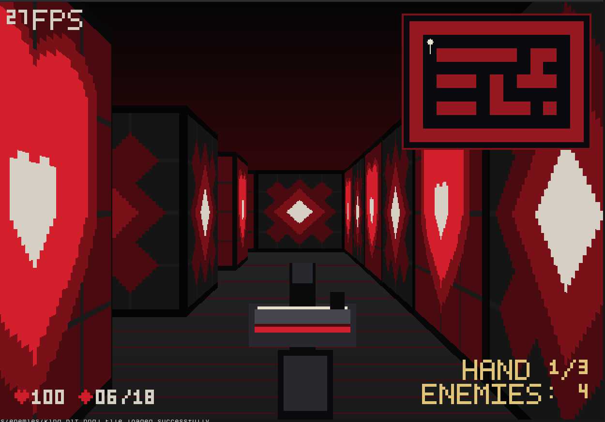

El vestíbulo de la casa. Paleta **carmesí sobre negro**, paredes con corazones y diamantes. Rejilla 13×9, el nivel más pequeño y directo. En Horde Mode: 4 → 8 → 16 Dealers y luego The King.

### II — Black Club

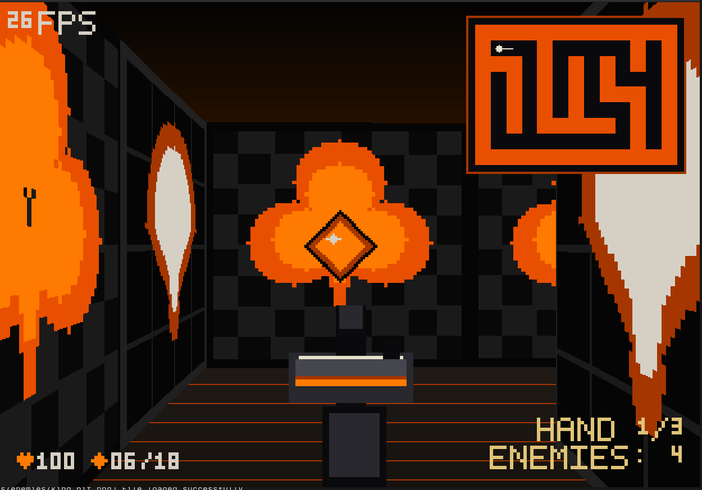

La sala de juego. Paleta **naranja neón sobre negro cuadriculado**, con el trébol (♣) como motivo. Rejilla 13×9. Misma progresión de Horde que Crimson Entrance (4 → 8 → 16 → The King).

### III — House of Cards

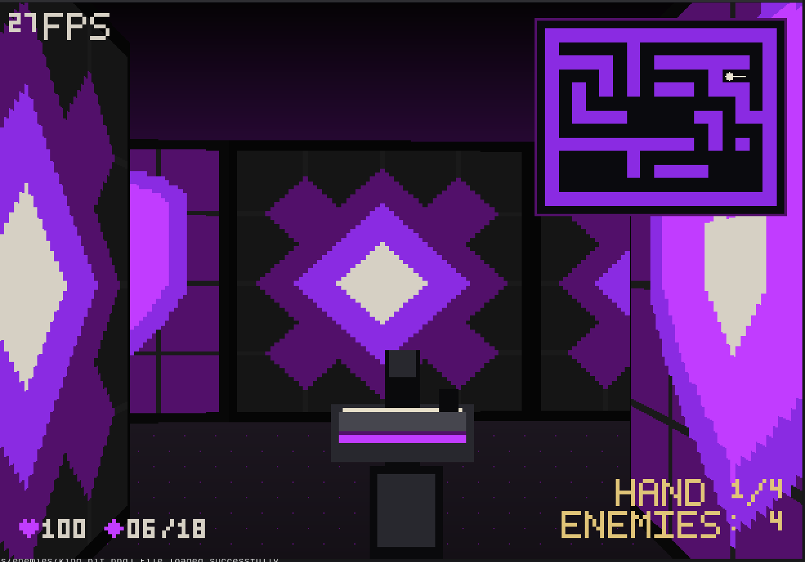

Las plantas altas. Paleta **violeta sobre negro**, motivo de diamante. Rejilla 17×13, claramente más grande y laberíntico. Es el único nivel con una oleada extra: 4 → 8 → 16 → 32 → The King.

### IV — The Dealer's True Maze


El corazón del casino. **Generado proceduralmente**: distinto en cada partida nueva. Área jugable de aproximadamente el doble que House of Cards, con **decenas de Dealers** (40–50 en la primera oleada) y The King poco después. Su tema visual (carmesí, naranja o violeta) se sortea en cada generación. Por su tamaño, los objetos se duplican y se marcan en el minimapa.

---

## The Dealer's True Maze (nivel procedural)

El cuarto nivel no vive en ningún archivo `.txt`. Se genera en memoria a partir de una semilla.

**Cómo se construye:**

1. Se traza un laberinto "perfecto" con *recursive backtracker* (árbol de expansión: exactamente un camino entre cada par de celdas).
2. Se añaden aristas extra al azar (bucles, bifurcaciones, rutas alternativas) hasta que el área jugable cae en el rango objetivo (~2× House of Cards, entre 1.8× y 2.2×).
3. Cada celda de pared recibe uno de los cuatro palos de la baraja al azar.
4. Se coloca el spawn del jugador, y la salida a una distancia navegable de entre el 75 % y el 90 % de la máxima alcanzable.
5. Se reparten los Dealers (densidad ~1 cada 9–10 celdas transitables, entre 18 y 30 en el mapa base), evitando el radio de seguridad alrededor del jugador.
6. Se reparten munición y vida (**el doble** que el presupuesto base, por el tamaño del nivel), priorizando callejones sin salida para premiar la exploración.
7. Se sortea el tema visual entre los tres existentes.

Si tras 25 intentos con semillas derivadas ninguna generación cumple todas las invariantes (conectividad, distancias mínimas, número de pickups), se usa un **mapa de emergencia fijo** siempre válido, para que el juego nunca arranque con un laberinto roto.

**Determinismo y semillas:**

- **Partida nueva** (elegir el nivel en Level Select, o llegar a él tras completar House of Cards): semilla nueva a partir del reloj del sistema → laberinto nuevo.
- **Retry** (desde Victory o Defeat): **reutiliza la misma semilla** → exactamente el mismo laberinto, mismo spawn, misma salida, mismos Dealers, mismos pickups, mismo tema. No se regenera.
- La misma semilla siempre produce el mismo nivel, bit a bit.

**Minimapa del nivel procedural:** además del jugador y las paredes, marca la posición de cada pickup de munición (punto azul), de vida (punto rojo) y de la **pistola dorada** (punto dorado). Estos marcadores **solo** aparecen en este nivel.

---

## Armas

Una sola arma, dos *tiers*. Cada tier tiene tres estados de animación.

### Standard

| Idle | Fire | Recoil |
|:---:|:---:|:---:|
|  |  | 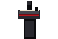 |
| Reposo. Estado por defecto. | Fogonazo al disparar (0.05 s). | Retroceso posterior (0.10 s). |

Daño: 50 por disparo.

### Royal Flush

| Idle | Fire | Recoil |
|:---:|:---:|:---:|
| 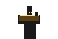 | 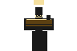 | 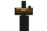 |
| Reposo, tras recoger el pickup. | Fogonazo (con su propio efecto de sonido). | Retroceso. |

Daño: 100 por disparo. Durante la recarga, el arma también muestra un desplazamiento de recarga sobre su posición base.

---

## Enemigos

### The Dealer

Crupier de la casa: traje negro, chaleco rojo, sombrero de ala ancha.

| Idle | Alert | Hit | Dead |
|:---:|:---:|:---:|:---:|
| 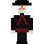 | 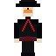 | 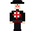 | 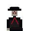 |
| Quieto, jugador lejos. | Jugador dentro del radio de alerta (4 celdas): persigue. | Reacción breve a un disparo no letal. | Cadáver, visible ~15 s antes de desaparecer. |

- Vida: 100 (2 disparos Standard, 1 Royal Flush).
- Ataque cuerpo a cuerpo: 10 de daño, una vez cada 0.9 s.
- Persigue con pathfinding BFS por el laberinto; se desliza célula a célula, nunca atraviesa paredes.

### The King

Crupier coronado con cetro y manto rojo.

| Idle | Hit | Dead |
|:---:|:---:|:---:|
|  | 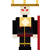 | 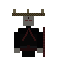 |
| Estado base: persigue y ataca. | Reacción a un disparo. | Cadáver, que permanece en el mapa durante el epílogo. |

Durante los estados protegidos (invocando o esperando a que limpies su cohorte), **The King utiliza una recolorización dorada aplicada en tiempo de render** sobre su sprite; no existe un archivo PNG dorado. Su radio de alerta es enorme: una vez que empieza el combate, nunca "pierde el interés".

---

## Objetos / Pickups

| Sprite | Objeto | Efecto |
|:---:|---|---|
|  | **Ammo Pickup** | +6 balas a la reserva (máx. 30). Si está llena, no se consume. |
|  | **Health Pickup** | +20 de vida (máx. 100). Si está llena, no se consume. |
|  | **Royal Flush** | Mejora el arma a *tier* Royal Flush (daño ×2). Solo en Horde Mode. |
|  | **Portal / meta** | Objetivo de Portal Mode: pisarlo gana el nivel. Oculto en Horde Mode. |

Todos son *billboards* que siempre miran a la cámara. El radio de recogida es cercano: hay que pasar prácticamente por encima.

---

## Identidad visual

El juego adopta una estética de casino corrompido con la baraja como lenguaje.

- **Palos de la baraja como paredes**: cada carácter del mapa (`+`, `-`, `|`, `#`) es una pared con textura de **corazón**, **diamante**, **trébol** o **pica** respectivamente.

  | Corazón | Diamante | Trébol | Pica |
  |:---:|:---:|:---:|:---:|
  |  |  | 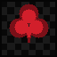 |  |

- **Adaptación de paleta por nivel**: las texturas de pared se recolorean en carga según el tema del nivel (carmesí / naranja neón / violeta). Un mismo `heart.png` se ve rojo en Crimson Entrance y violeta en House of Cards.
- **Antorchas**: decoración animada de 4 fotogramas (`torch_01.png` … `torch_04.png`), colocada en los marcadores `t` del mapa. La animación avanza con el tiempo real.

  | | | | |
  |:---:|:---:|:---:|:---:|
  |  |  |  |  |

- **Fuente bitmap propia** de 5×7 píxeles para todo el texto del HUD y los menús, coherente con la resolución baja.

---

## HUD y minimapa

El **minimapa** se dibuja arriba a la derecha sobre la vista 3D. No rota (solo el indicador de dirección del jugador sigue la cámara) y no es un segundo *viewport*: no reduce la escena.

| Marcador | Aspecto | Cuándo aparece |
|---|---|---|
| Jugador | Punto marfil + línea de dirección | Siempre. |
| Paredes | Trazo del color de acento del nivel | Siempre (nivel completo a escala). |
| The King | Rombo dorado con un punto oscuro al centro | **Solo mientras The King huye** (fase Fleeing y la invocación de castigo). |
| Munición | Punto azul | **Solo en The Dealer's True Maze.** |
| Vida | Punto rojo | **Solo en The Dealer's True Maze.** |
| Royal Flush | Punto dorado (algo mayor) | **Solo en The Dealer's True Maze.** |

En los tres niveles fijos, el minimapa muestra únicamente el mapa y el jugador (y The King durante su huida), exactamente como siempre.

---

## Pausa

Pulsar `Esc` durante la partida abre el menú de **pausa**:

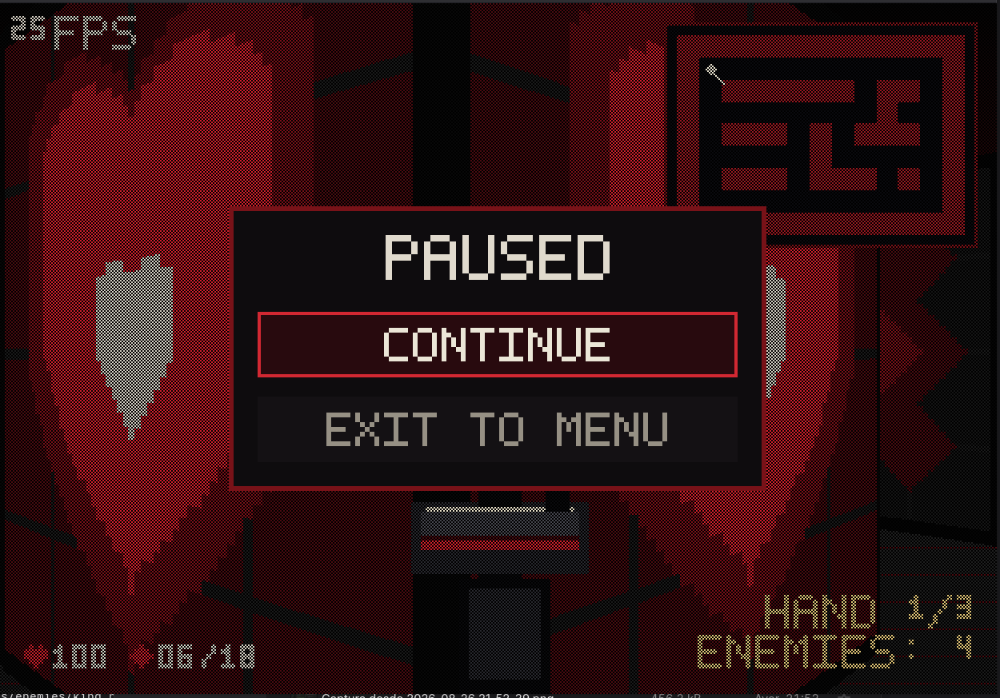

- **`CONTINUE`** — Reanuda exactamente donde estabas. La sesión no se toca: la misma partida sigue congelada detrás.
- **`EXIT TO MENU`** — Vuelve a la pantalla de bienvenida (se abandona la partida).

Al pausar, **toda** la simulación jugable se congela (jugador, arma, recarga, enemigos, animaciones, temporizadores). No hay reloj de pared: nada avanza mientras la pausa está activa.

La **música se suspende** conservando su posición y su selección: al reanudar continúa desde donde estaba, sin reiniciarse ni volver a la música de nivel si estabas en la batalla final.

---

## Victory y Defeat

| Victory | Defeat |
|:---:|:---:|
| 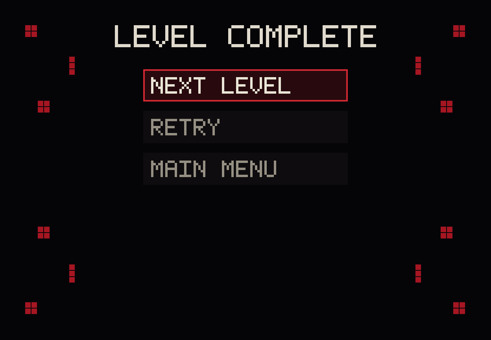 | 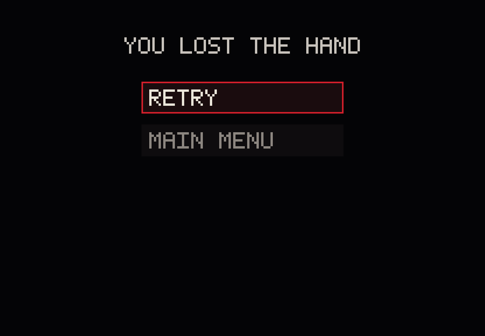 |

### Victory — `LEVEL COMPLETE`

Cuándo ocurre:

- **Portal Mode**: al pisar el portal.
- **Horde Mode**: cuando The King ha caído y ha terminado su epílogo de 7 s.

Opciones: `NEXT LEVEL` (deshabilitada si es el último nivel), `RETRY`, `MAIN MENU`.

Si el jugador muere y alcanza la meta en el mismo instante, **prevalece la derrota**.

### Defeat — `YOU LOST THE HAND`

Ocurre cuando la vida del jugador llega a **0** durante la partida. No hay estado intermedio de "vida crítica": exactamente 0 es la condición.

Opciones: `RETRY` (reconstruye una sesión nueva del mismo nivel), `MAIN MENU`.

---

## Bienvenida y selección de nivel

La pantalla de **bienvenida** muestra el título `RED-BLACK MAZE` y un botón `PLAY`, sobre un fondo animado (una simulación del **Juego de la Vida de Conway**). Se avanza con `Enter`, `Espacio` o clic en `PLAY`.

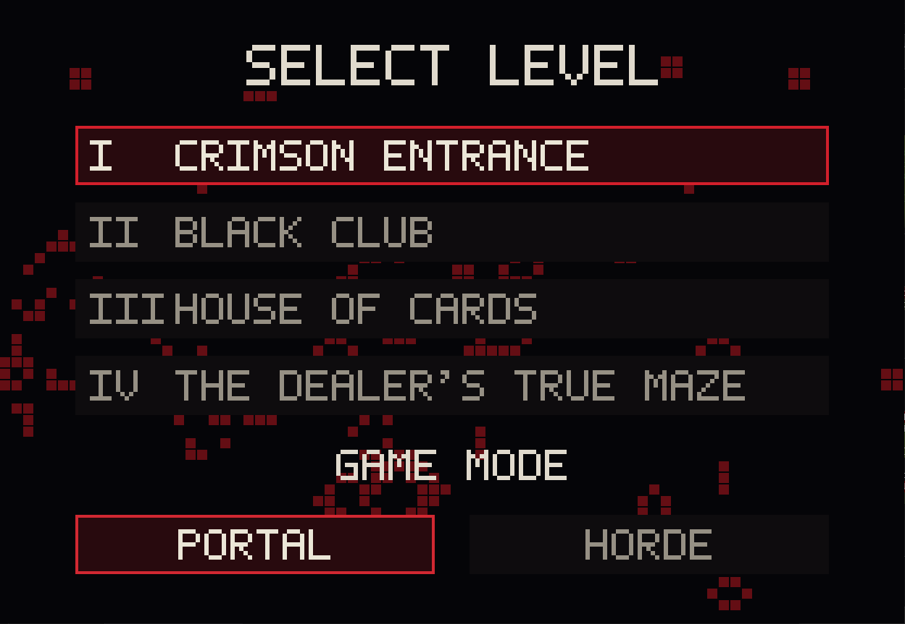

En **Level Select** el jugador elige:

- **Nivel** (`↑` `↓` o `W` `S`): `I CRIMSON ENTRANCE`, `II BLACK CLUB`, `III HOUSE OF CARDS`, `IV THE DEALER'S TRUE MAZE`.
- **Modo** (`←` `→` o `A` `D`): `PORTAL` o `HORDE`.
- Confirmar con `Enter` o clic. `Esc` vuelve a la bienvenida.

[▶ Ver la interfaz de bienvenida y selección](docs/videos/welcome.mp4)

---

## Audio

El sonido está centralizado en un único **`AudioManager`**: el resto del juego pide reproducción por valores semánticos (`MusicTrack::FinalBattle`, `SoundEffect::KingSummon`, …), nunca por ruta de archivo.

**Música** (8 pistas): menú, una por tema de nivel (Crimson Entrance / Black Club / House of Cards), The Dealer's True Maze, victoria, derrota y **batalla final**. `set_music` es *no-op* si la pista ya está sonando, así que ninguna transición reinicia una canción sin querer.

**Efectos de sonido** (21): disparo, disparo de Royal Flush, impacto en pared, recarga, pasos, daño al jugador; alerta / impacto / muerte del Dealer y su sonido de acecho; recogida de munición / vida / Royal Flush; movimiento y selección de menú; victoria; y los cinco de The King: aparición, impacto, ataque, muerte e **invocación**.

- El **impacto contra The King** produce un único sonido autoritativo por disparo (impacto normal, o rotura de fase). Un disparo que rebota por su blindaje produce el sonido de deflexión.
- La música se **suspende y reanuda** con la pausa, conservando la posición.
- Victoria y derrota conmutan a su pista correspondiente, deteniendo lo que estuviera sonando.

### Batalla final (Final Battle)

La batalla contra The King tiene una transición musical propia, en tres tramos:

| Momento | Música |
|---|---|
| The King aparece | Sigue la música del nivel. |
| Primera invocación (umbral 800) | **Silencio** durante toda la animación de invocación. |
| Fin de esa primera invocación | Arranca `final_battle.mp3`. |
| Resto del combate (600 / 400 / 200 / huida) | `final_battle.mp3` continúa sin cortes. |
| Victoria / derrota | Transición a la pista correspondiente. |

Este ciclo nunca retrocede: una vez que suena la batalla final, no se vuelve a la música del nivel dentro de esa partida (ni siquiera al pausar).

---

## Capturas y videos

Todas las capturas están en [`docs/screenshots/`](docs/screenshots/) y los videos en [`docs/videos/`](docs/videos/).

| Escena | Archivo |
|---|---|
| Selección de nivel y modo | [`01-level-select.png`](docs/screenshots/01-level-select.png) |
| Crimson Entrance | [`02-crimson-entrance.png`](docs/screenshots/02-crimson-entrance.png) |
| Black Club | [`03-black-club.png`](docs/screenshots/03-black-club.png) |
| House of Cards | [`04-house-of-cards.png`](docs/screenshots/04-house-of-cards.png) |
| The Dealer's True Maze | [`05-the-dealers-true-maze.png`](docs/screenshots/05-the-dealers-true-maze.png) |
| Pausa | [`06-pause.png`](docs/screenshots/06-pause.png) |
| Victoria | [`07-victory.png`](docs/screenshots/07-victory.png) |
| Derrota | [`08-defeat.png`](docs/screenshots/08-defeat.png) |
| Portal Mode (video) | [`mod_portal.mp4`](docs/videos/mod_portal.mp4) |
| Horde Mode (video) | [`mod_horde.mp4`](docs/videos/mod_horde.mp4) |
| Bienvenida / selección (video) | [`welcome.mp4`](docs/videos/welcome.mp4) |

---

# Cumplimiento de los criterios de evaluación

Esta sección describe cómo el proyecto evidencia, de forma directa y verificable en el código y en el juego, los criterios de la práctica.

### Raycaster completo y jugable

El renderizado 3D es un *raycaster* propio ([`src/raycasting/`](src/raycasting/), [`src/rendering/world_3d.rs`](src/rendering/world_3d.rs)): se lanza un rayo por cada columna de pantalla (624), se marcha en pasos de 1 píxel hasta encontrar una celda no transitable y se refina analíticamente hasta el borde exacto de la pared; la altura de la columna se proyecta con corrección de ojo de pez (distancia perpendicular). El juego es jugable de principio a fin en cuatro niveles, dos de ellos con jefe final.

### Colisiones

El jugador nunca atraviesa paredes: [`src/world/collision.rs`](src/world/collision.rs) (`can_occupy`) valida cada eje por separado en [`src/input/controller.rs`](src/input/controller.rs), lo que además permite deslizarse a lo largo de una pared en vez de detenerse. Los enemigos usan la misma noción de celda transitable para su pathfinding.

### Texturas e identidad visual de paredes

Cuatro texturas de pared (`heart`, `diamond`, `club`, `spade`) mapeadas 1:1 a los caracteres del mapa, recoloreadas por tema de nivel en carga ([`src/rendering/textures.rs`](src/rendering/textures.rs), [`src/rendering/palette.rs`](src/rendering/palette.rs)). Cada nivel tiene una paleta de acento distinta y coherente (carmesí, naranja neón, violeta).

### Cámara y movimiento

Movimiento con `W` `A` `S` `D` y giro de cámara con el ratón, en canales independientes ([`src/input/controller.rs`](src/input/controller.rs)). Movimiento diagonal normalizado, independiente del *framerate* (todo escala por `delta_time`).

### Disparo

Combate *hitscan* ([`src/raycasting/hitscan.rs`](src/raycasting/hitscan.rs)): el disparo va por la línea de la mira y golpea al enemigo más cercano antes de la primera pared. Sistema de cargador (6) + reserva (máx. 30) con animación de recarga ([`src/player/weapon.rs`](src/player/weapon.rs)).

### Minimapa

Minimapa en la esquina superior derecha ([`src/rendering/minimap.rs`](src/rendering/minimap.rs)): mapa completo del nivel a escala, posición y orientación del jugador, y —según el contexto— The King durante su huida y los objetos del nivel procedural.

### Música de fondo

Banda sonora propia con pista por nivel y transición especial durante la batalla final ([`src/audio/manager.rs`](src/audio/manager.rs)). Ver [Audio](#audio).

### Efectos de sonido

21 efectos cubriendo disparo, impactos, recarga, pasos, daño, pickups, menús y todo el repertorio de The King ([`src/audio/manager.rs`](src/audio/manager.rs)).

### Animaciones

- **Arma**: idle / fire / recoil / reload, con temporizadores propios.
- **Antorchas**: 4 fotogramas en bucle, sobre tiempo real.
- **The King**: animación de invocación (pulso dorado) que se repite en cada umbral.
- **Estados de enemigo**: transición visual Idle → Alert → Hit → Dead.
- **Flash de daño** al jugador y **fondo animado** (Juego de la Vida) en la bienvenida.

### Pantalla de bienvenida y selección de niveles

[`src/ui/welcome.rs`](src/ui/welcome.rs) (título + `PLAY` + fondo animado) y [`src/ui/level_select.rs`](src/ui/level_select.rs) (elección de nivel y de modo, navegable por teclado y ratón).

### Pantallas de salida

Victoria ([`src/ui/victory.rs`](src/ui/victory.rs)) y derrota ([`src/ui/defeat.rs`](src/ui/defeat.rs)), cada una con menú funcional; más el menú de pausa ([`src/ui/pause.rs`](src/ui/pause.rs)). Las condiciones de transición son reglas puras y probadas ([`src/game/state.rs`](src/game/state.rs)).

### FPS

Contador de FPS visible en todo momento durante la partida (`N FPS`, arriba a la izquierda), leído de la media móvil de Raylib. El objetivo de render es 60 FPS (`TARGET_FPS`), toda la simulación es independiente del *framerate*, y el renderizado usa un *framebuffer* lógico fijo de 624×432 con un solo búfer de profundidad por columna para mantener el coste estable. El contador permite comprobar el rendimiento real en cada máquina.

> No hay soporte de mando / *gamepad*: el juego se controla exclusivamente con teclado y ratón.

---

# Arquitectura del proyecto

## Organización del código

```
src/
├── main.rs / lib.rs      Punto de entrada y declaración de módulos.
├── app.rs                Bucle principal: máquina de estados, update/render, orquestación de audio.
├── config.rs             Constantes globales (tamaño de bloque, resolución lógica, FPS objetivo, sensibilidad).
│
├── game/
│   ├── state.rs          GameState (Welcome/LevelSelect/Playing/Paused/Victory/Defeat) y reglas de transición.
│   ├── mode.rs           GameMode (Portal / Horde).
│   ├── session.rs        GameSession: estado central de la partida (jugador, entidades, pickups,
│   │                     Royal Flush, KingEncounter, música del jefe). El módulo más grande.
│   └── hand.rs           HordeManager: progresión de Dealer Hands, semillas de recursos, selección de celdas.
│
├── player/
│   ├── player.rs         Posición, ángulo, FOV, vida.
│   └── weapon.rs         Cargador/reserva, estados de arma, tier (Standard / Royal Flush), daño.
│
├── input/
│   └── controller.rs     Teclado + ratón → movimiento y rotación, con colisión por eje.
│
├── raycasting/
│   ├── caster.rs         cast_ray: marcha de rayo + refinamiento al borde de pared.
│   ├── fov.rs            Distribución angular de los rayos por columna.
│   ├── hit.rs            RayHit (distancia, cara, coordenada de textura).
│   └── hitscan.rs        cast_hitscan: rayo de la mira contra enemigos y paredes.
│
├── rendering/
│   ├── framebuffer.rs    Framebuffer software subido a una textura persistente por cuadro.
│   ├── world_3d.rs       Proyección de paredes con textura + búfer de profundidad por columna.
│   ├── sprites.rs        Billboards (enemigos, pickups, meta), orden pintor, recolor dorado de The King.
│   ├── map_2d.rs         Vista cenital de depuración.
│   ├── minimap.rs        Minimapa de esquina y sus marcadores.
│   ├── hud.rs            Vida/munición, FPS, contadores de Horde, barra de The King, mensajes.
│   ├── weapon.rs         Dibujo del arma en primera persona.
│   ├── background.rs     Cielo/suelo por tema.
│   ├── palette.rs        Paletas de acento por LevelTheme.
│   ├── textures.rs       Carga y recoloreado de texturas.
│   └── hit_flash.rs      Flash rojo al recibir daño.
│
├── audio/
│   └── manager.rs        AudioManager: MusicTrack, SoundEffect, transiciones, pasos, música del jefe.
│
├── ui/
│   ├── welcome.rs        Título + PLAY.
│   ├── game_of_life.rs   Simulación de Conway del fondo de la bienvenida.
│   ├── level_select.rs   Selección de nivel y modo.
│   ├── pause.rs          Menú de pausa.
│   ├── victory.rs        Pantalla de victoria.
│   └── defeat.rs         Pantalla de derrota.
│
└── world/
    ├── level.rs          Carga y validación de un nivel (grid, spawns, meta).
    ├── level_manager.rs  Catálogo de niveles, tema activo, configuración de Horde por nivel.
    ├── level_generator.rs Generación procedural de The Dealer's True Maze.
    ├── rng.rs            Generador pseudoaleatorio determinista (SplitMix64).
    ├── pathfinding.rs    DistanceField (BFS 4-direcciones): persecución y huida.
    ├── collision.rs      can_occupy: regla única de "el jugador cabe aquí".
    ├── tile.rs           Clasificación semántica de cada carácter del mapa.
    ├── entity.rs         Entity, EnemyKind (Dealer / King), EntityState, daño, corpse timer.
    ├── ammo_pickup.rs / health_pickup.rs / royal_flush_pickup.rs   Pickups del mundo.

levels/          level_01.txt … level_03.txt (niveles fijos en texto).
assets/          textures/ (paredes, sprites, arma), audio/ (music/, sfx/).
docs/            screenshots/, videos/.
tests/           Pruebas de integración (collision, level_loading, raycasting, shooting, victory).
```

## Raycasting

- **Paredes** ([`caster.rs`](src/raycasting/caster.rs) + [`world_3d.rs`](src/rendering/world_3d.rs)): un rayo por columna de pantalla, repartidos linealmente en el FOV de 60° alrededor del ángulo del jugador. El rayo avanza en pasos de 1 píxel hasta caer en una celda no transitable y luego se calcula analíticamente el punto exacto de entrada a esa celda, del que salen la distancia, la cara golpeada y la coordenada horizontal de textura.
- **Corrección de ojo de pez**: la altura proyectada de cada columna usa la distancia *perpendicular* al plano de proyección (`distancia · cos(ángulo relativo)`), no la distancia radial.
- **Búfer de profundidad por columna**: `world_3d` rellena un `Vec<f32>` con la profundidad de la pared de cada columna; los sprites lo consultan para ocultarse detrás de las paredes.
- **Sprites / billboards** ([`sprites.rs`](src/rendering/sprites.rs)): cada enemigo, pickup y la meta se proyecta como una textura que siempre mira a la cámara, ordenados de lejos a cerca (algoritmo del pintor) y recortados por columna contra el búfer de profundidad de ese mismo cuadro.
- **Hitscan** ([`hitscan.rs`](src/raycasting/hitscan.rs)): el disparo lanza un único rayo por el centro de la pantalla; devuelve el enemigo cuyo círculo de impacto se cruza primero, o la pared si no hay ninguno antes.

## Entidades y combate

Una decisión de diseño central: **The King no tiene un sistema paralelo**. Es un `Entity` más, con `EnemyKind::King` en vez de `EnemyKind::Dealer`. Reutiliza exactamente la misma infraestructura que el Dealer:

- el mismo `Entity` (posición, vida, estado, temporizador de cadáver);
- el mismo billboard y el mismo z-test por columna;
- las mismas transiciones de estado `Idle → Alert → Hit → Dead`;
- el mismo movimiento por celdas y la misma detección de colisión;
- el mismo camino de daño (`apply_damage`) y las mismas rutas de audio de impacto/muerte;
- la misma limpieza de cadáver.

Lo específico de The King (umbrales de vida, invocaciones, invulnerabilidad, huida, música de jefe) vive en la estructura `KingEncounter` dentro de `GameSession`, que **decora** ese `Entity` compartido en vez de duplicarlo. Los Dealers que invoca son `Entity` normales marcados con el índice de su cohorte.

## Pathfinding

[`src/world/pathfinding.rs`](src/world/pathfinding.rs) — `DistanceField`: un campo de distancias por BFS de 4 direcciones sobre las celdas transitables, con origen en la celda del jugador. Reutiliza `Level::is_walkable` como única autoridad de qué celda es transitable.

- **Persecución** (`step_toward_origin`): el enemigo elige el vecino cuya distancia al jugador es menor, avanzando por el gradiente. Un fallback controlado cubre el caso de "enemigo y jugador en la misma celda" sin atravesar paredes.
- **Huida de The King** (`farthest_reachable_cell` + un segundo campo enraizado en esa meta): en vez de dar pasos codiciosos vecino a vecino —que hacían que el jefe oscilara sobre un máximo local—, The King fija como meta el rincón navegable más lejano del jugador y recorre un campo de distancias hacia allí. La meta solo se recalcula cuando la alcanza, deja de ser alcanzable, o el jugador se interpone. Al quedar acorralado, se detiene.

## Generación procedural

[`src/world/level_generator.rs`](src/world/level_generator.rs) — función pura de la semilla:

1. `carve_spanning_tree` traza un laberinto perfecto (recursive backtracker) sobre una rejilla lógica 11×9.
2. Se añaden aristas extra aleatorias hasta acercar el área jugable a ~2× House of Cards.
3. Se asignan palos de baraja a las paredes, se sitúan spawn / meta / Dealers / pickups respetando distancias mínimas, y se sortea el tema visual.
4. Hasta 25 reintentos con semillas derivadas; si todo falla, un mapa de emergencia fijo.

El RNG ([`src/world/rng.rs`](src/world/rng.rs)) es un SplitMix64 determinista: misma semilla → misma secuencia → mismo nivel. [`src/world/level_manager.rs`](src/world/level_manager.rs) cachea la generación vigente para que **Retry** reconstruya el mismo mapa sin regenerar, mientras que una **partida nueva** toma una semilla del reloj del sistema.

## AudioManager

[`src/audio/manager.rs`](src/audio/manager.rs) centraliza todo el sonido. El resto del código nunca abre un archivo de audio ni llama a Raylib para reproducir: pide `set_music(MusicTrack::…)` o `play_sound(SoundEffect::…)`. `set_music` ignora la petición si esa pista ya está sonando, lo que hace que las transiciones sean idempotentes. La lógica de la música del jefe (nivel → silencio → batalla final) vive como una pequeña máquina de estados (`BossMusicState`) que `App` sincroniza una vez por cuadro.

## Sistema de UI

Cada pantalla ([`src/ui/`](src/ui/)) es un tipo independiente que se dibuja sobre el `Framebuffer` con la fuente bitmap 5×7 propia. La navegación (teclado + ratón) y la selección resaltada viven en cada pantalla; `App` solo traduce la opción elegida a un cambio de `GameState`. El fondo de la bienvenida es una simulación real del Juego de la Vida de Conway ([`game_of_life.rs`](src/ui/game_of_life.rs)).

## Estados del juego

[`src/game/state.rs`](src/game/state.rs) — `GameState`:

```
Welcome ──► LevelSelect ──► Playing ──► Victory
                              │  ▲          │
                              ▼  │          ▼
                            Paused      (NEXT LEVEL / RETRY / MAIN MENU)
                              │
                              ▼
                            Defeat ──► (RETRY / MAIN MENU)
```

- `Paused` es la **misma** `GameSession` congelada; solo se llega desde `Playing` y solo se vuelve a `Playing` o a `Welcome`.
- `Defeat` **no** es una congelación: la sesión muerta no se vuelve a actualizar nunca; `RETRY` construye una `GameSession` totalmente nueva.
- La resolución terminal de cada cuadro de `Playing` es una regla pura única (`resolve_playing_terminal_state`) que garantiza que la **derrota siempre gana** a la victoria si ambas se cumplen a la vez.

## Determinismo y semillas

Todo lo aleatorio del juego pasa por `Rng` (SplitMix64) con semillas derivadas de forma determinista (`derive_resource_seed`): la generación del laberinto, la selección de celdas de aparición de cada oleada, los pickups de reabastecimiento, la colocación de Royal Flush y de The King. Esto hace que el comportamiento sea reproducible: la misma semilla produce la misma partida, y **Retry** en el nivel procedural reproduce exactamente el mismo laberinto.

## Testing

El proyecto tiene **808 pruebas** (773 unitarias + 35 de integración), todas en verde:

```
cargo test
```

Cubren, entre otras cosas:

- **Raycasting**: distancias y caras conocidas, distribución angular de columnas, hitscan contra objetivos y paredes.
- **Colisión**: el jugador no atraviesa paredes; deslizamiento por eje.
- **Carga de niveles**: validación de grids, spawns únicos, meta alcanzable.
- **Entidades y combate**: vida, transiciones de estado, cooldowns de ataque, temporizador de cadáver, daño de Dealer (10) y de The King (20).
- **Armas**: cargador/reserva, topes, daño por tier, animaciones.
- **Horde**: escalado ×2, topes por nivel, intermisiones, mensajes, Final Hand.
- **The King**: los cuatro umbrales, invocaciones (5/5/5/10), *gate* de invulnerabilidad, huida sin oscilar, cuenta atrás y oleada de castigo de 16, epílogo de 7 s, aislamiento respecto a Portal Mode.
- **Audio**: transiciones de la música del jefe, un solo sonido de impacto por disparo, continuidad tras la pausa.
- **UI / estados**: reglas de transición (prioridad de la derrota), navegación de menús, congelación en pausa.
- **Generación procedural**: conectividad, distancias mínimas, número de pickups (duplicado), determinismo por semilla, reutilización de semilla en Retry.

---

# Instalación y ejecución

## Requisitos

- **Rust** y **Cargo** (edición 2024; se recomienda `rustup` con un toolchain estable reciente).
- Herramientas de compilación de C y CMake (la dependencia `raylib` compila Raylib desde el código fuente incluido).
- Bibliotecas de desarrollo del sistema para gráficos y audio.

En **Fedora**:

```bash
sudo dnf install gcc gcc-c++ cmake \
  alsa-lib-devel mesa-libGL-devel \
  libX11-devel libXcursor-devel libXrandr-devel \
  libXinerama-devel libXi-devel
```

(En Wayland puede además hacer falta `wayland-devel` y `libxkbcommon-devel`.)

## Compilar y jugar

```bash
git clone <url-del-repositorio>
cd red-black-maze

# Ejecutar (la primera vez compila todo el proyecto):
cargo run --release
```

El binario debe ejecutarse desde la raíz del repositorio: las rutas de `levels/` y `assets/` son relativas al directorio de trabajo.

## Comandos útiles

```bash
cargo run --release      # jugar
cargo test               # ejecutar las 808 pruebas
cargo fmt --check        # comprobar formato
cargo check              # comprobación rápida de compilación
```

---

# Estructura del repositorio

```
red-black-maze/
├── Cargo.toml            Metadatos y dependencia de raylib 6.0.
├── README.md             Este documento.
├── src/                  Código fuente (ver «Organización del código»).
├── levels/               level_01.txt … level_03.txt (niveles fijos).
├── assets/
│   ├── textures/
│   │   ├── walls/        heart, diamond, club, spade.
│   │   ├── sprites/      pickups, meta, enemies/ (dealer*, king*), torch/ (4 frames).
│   │   └── weapon/       weapon_* y royal_weapon_* (idle / fire / recoil).
│   └── audio/
│       ├── music/        8 pistas .mp3.
│       └── sfx/          21 efectos .wav.
├── docs/
│   ├── screenshots/      01–08 (menús, niveles, pausa, victoria, derrota).
│   └── videos/           mod_portal.mp4, mod_horde.mp4, welcome.mp4.
└── tests/                Pruebas de integración.
```

Formato de los niveles fijos (`levels/*.txt`):

| Carácter | Significado |
|:---:|---|
| `p` | Aparición del jugador |
| `g` | Meta / portal |
| `e` | Aparición de un Dealer |
| `a` | Pickup de munición |
| `h` | Pickup de vida |
| `t` | Antorcha (decoración) |
| espacio | Suelo transitable |
| `+` `-` `\|` `#` | Pared: corazón / diamante / trébol / pica |

---

# Decisiones de diseño

- **The King reutiliza la infraestructura del Dealer.** Un jefe no justifica un motor de entidades paralelo: comparte `Entity`, billboard, estados, movimiento, daño, audio y limpieza. Lo propio del jefe (fases, invocaciones, música) *decora* ese `Entity`, no lo sustituye.
- **`Level` es un tipo compartido para niveles fijos y procedural.** El generador produce la misma estructura de celdas que un `.txt`; a partir de ahí, carga, colisión, raycasting y pathfinding no distinguen el origen.
- **RNG determinista con semillas derivadas.** Todo lo aleatorio es reproducible. Retry en el nivel procedural recupera el mismo laberinto; una partida nueva toma una semilla del reloj.
- **Horde Mode y Portal Mode como un `enum`, no como banderas.** `GameMode` es la única fuente de verdad; cada sistema (portal, Dealer Hands, Royal Flush, The King) consulta ese valor en vez de mantener booleanos que podrían divergir.
- **Royal Flush como *tier* de la misma arma.** Un cargador, una reserva; el tier solo selecciona daño, sprites y sonido de disparo. Nada de inventario ni de una segunda arma.
- **`AudioManager` centralizado.** El resto del código pide sonido por valores semánticos; el manager es el único que conoce rutas y estado de reproducción.
- **Renderizado por *framebuffer* software.** El mundo se dibuja en un búfer lógico fijo (624×432) que se sube a una textura una vez por cuadro; la resolución de juego no depende del tamaño de ningún nivel ni de la ventana.
- **Fases del jefe basadas en umbrales de vida, con *gate* explícito.** Al cruzar un umbral con la cohorte anterior todavía viva, The King se queda clavado en ese umbral hasta que el jugador la limpia, con feedback inequívoco (dorado + pulso + aviso + deflexión) para que la invulnerabilidad nunca se lea como un bug.
- **Seguridad de recursos.** Reabastecimiento por tramos según el estado real del jugador y munición de emergencia a mitad de oleada: el jugador nunca queda atrapado sin balas por mala suerte, pero tampoco nada regala recursos cuando no hacen falta.
- **Toda la simulación es independiente del *framerate*** y avanza solo por el `delta_time` que `App` entrega cada cuadro. No pausar `update_playing` congela absolutamente todo, sin un mecanismo de pausa por subsistema.

---

## Música

La banda sonora utilizada en Red-Black Maze fue generada específicamente para el proyecto mediante **Suno**. El juego no incorpora canciones comerciales ni música extraída de artistas externos, evitando el uso de material musical comercial protegido de terceros.

Los efectos de sonido son igualmente propios del proyecto.

---

<p align="center">
  <em>Red-Black Maze — Rust · Raylib · raycasting</em>
</p>
